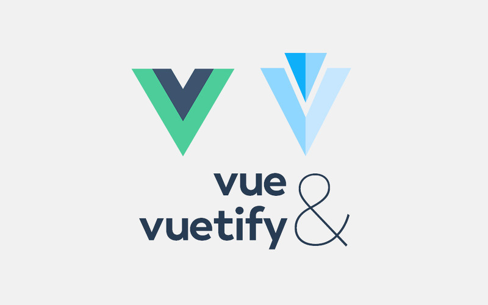

# Vue JS / Vuex - Task manager using Vietify

_October 2021_

> 🔨 From udemy: [Vuetify: Create an App with Vue JS & Vuex - Danny Connel](https://www.udemy.com/course/vuetify-vuejs-vuex).

---



## Vuex

### Store

```js
export default new Vuex.Store({
  state: {
    // we store all datas here
    // they can be accessed from everywhere in the app
  },
  mutations: {
    // methods that change data in the state by triggering/commiting
    // synchronously (we cannot reach an API)
  },
  actions: {
    // can't change data in the state
    // dispatch actions then commit mutations
    // asynchronously (we can reach an API)
  },
  getters: {
    // we can get datas from the state
    // we can change or update datas before making them available for all components
  }
  modules: {
    // we can divide the store in several modules
    // all modules can manage their own states, mutations, options and getters
  },
});
```

### Split modules

```js
const moduleA = {
  state: () => ({ ... }),
  mutations: { ... },
  actions: { ... },
  getters: { ... }
}

const moduleB = {
  state: () => ({ ... }),
  mutations: { ... },
  actions: { ... }
}

const store = new Vuex.Store({
  modules: {
    a: moduleA,
    b: moduleB
  }
})

store.state.a // -> `moduleA`'s state
store.state.b // -> `moduleB`'s state
```

## Dependancies / Plugins

- [Vuetify](https://vuetifyjs.com/en/): Material Design Framework

`vue add vuetify`

## useful links

- [Make Apps with Danny - Vue.js Basics](https://www.youtube.com/watch?v=O25jFVucQiw)
- [Make Apps with Danny - Vue js Lists & Child Components](https://www.youtube.com/watch?v=VVjHdzRBCrA)
- [Outils de développement Vue 3 | Quoi de neuf?](https://www.youtube.com/watch?v=ZBkZ7apIA_Y)
- [Vuetify roadmap](https://vuetifyjs.com/en/introduction/roadmap/#v30-titan)
- [Computed Props and Watchers — What's the Difference?](https://michaelnthiessen.com/difference-between-computed-property-and-watcher/n)
